Here is the complete set of architecture diagrams and accompanying analyses reverse-engineered directly from the repository.

---

## 1. System Context Diagram

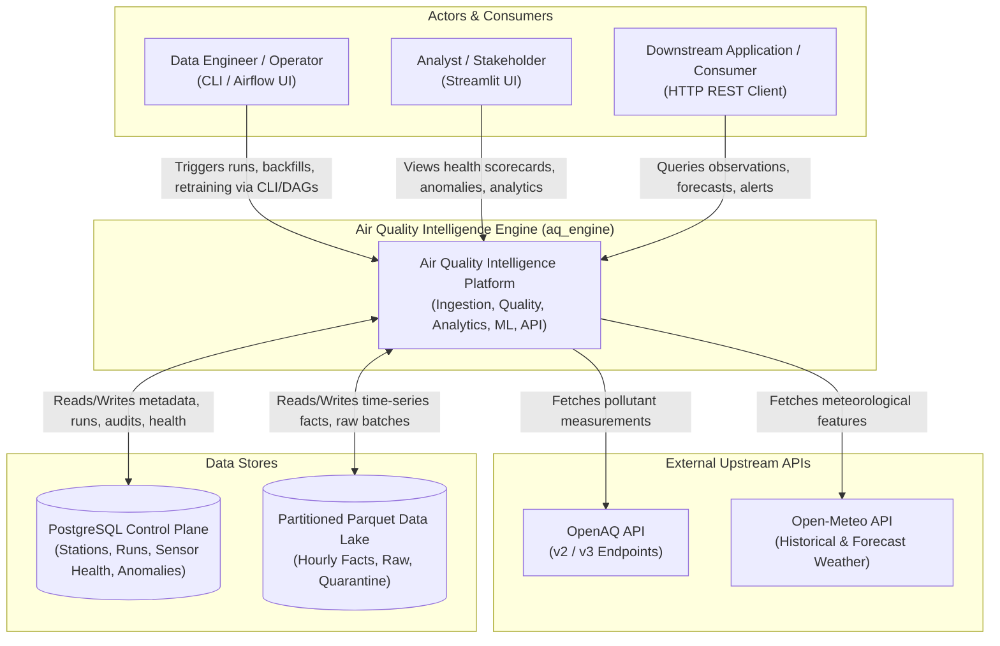

### How to read this diagram

This diagram shows the system boundary of `aq_engine`, its primary human and machine actors, the external web APIs it pulls from, and the two data stores it persists information into.

### Important observations

* **Dual Ingestion Sources:** The system couples pollutant data with meteorological conditions from separate upstream providers (`OpenAQ` and `Open-Meteo`).


* **Hybrid Storage Separation:** Analytical time-series facts are decoupled from relational state and transactional execution logs.


* **Multiple Consumption Interfaces:** Interaction happens via REST APIs, analytical dashboards, or direct operator CLI commands.


### Questions to ask yourself

1. Why does the system separate metadata into PostgreSQL and time-series data into Parquet?
2. What happens to the system if Open-Meteo is unavailable while OpenAQ is healthy?
3. Which actors trigger batch processing versus real-time queries?
4. How do downstream API clients authenticate when querying endpoints?
5. Where does human intervention occur during data quarantine events?

---

## 2. Container Diagram

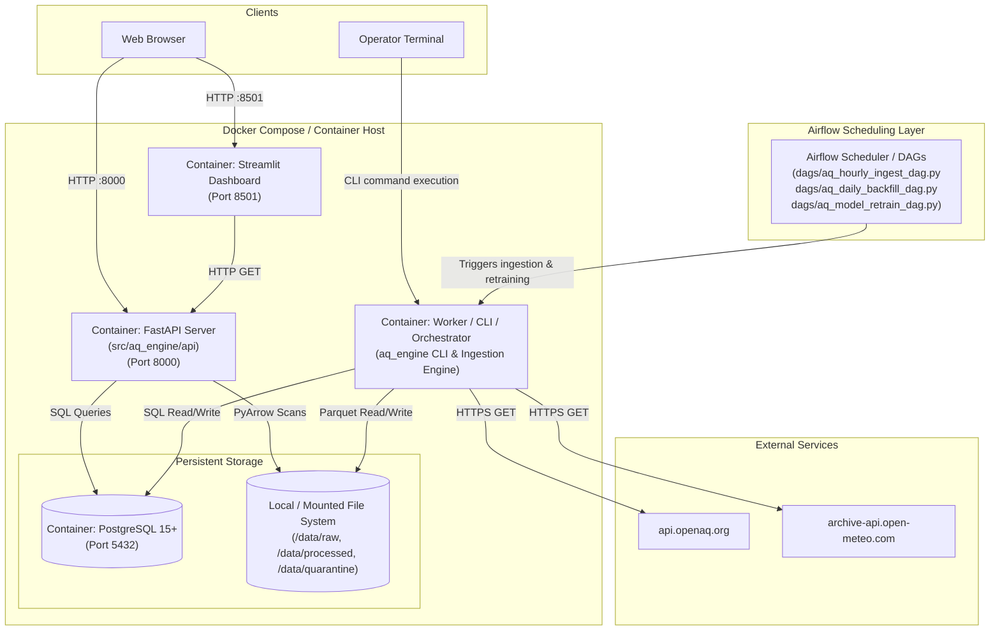

### How to read this diagram

This diagram details the runtime containers specified in `docker-compose.yml` and the Dockerfiles (`Dockerfile.api`, `Dockerfile.dashboard`, `Dockerfile.worker`), showing how network requests flow between services, shared volumes, and database ports.

### Important observations

* **Decoupled API and Dashboard:** Streamlit runs in a dedicated container and queries FastAPI / storage rather than embedding pipeline ingestion directly.


* **Shared Storage Volume:** The Parquet Lakehouse relies on a mounted directory accessible by both the Worker (for writes) and the API (for analytical reads).


* **No Distributed Message Queue:** *Observable Fact:* The repository does not include RabbitMQ, Kafka, or Redis in its Compose definitions; Airflow and cron/CLI act as the execution dispatchers.


### Questions to ask yourself

1. If the Parquet store is on a mounted volume, what happens when scaling the API container across multiple hosts?
2. How does the worker container coordinate simultaneous writes to Parquet files?
3. What mechanism notifies the API when new data is committed to the file system?
4. How do health checks in `docker/health-check.sh` determine if the API container is ready to receive traffic?


5. Why is Streamlit separated from FastAPI rather than serving static frontend assets directly from FastAPI?

---

## 3. Component Diagram

```mermaid
flowchart TB
    subgraph IngestionSubsystem["1. Ingestion Subsystem (src/aq_engine/ingestion & connectors)"]
        BaseConn["BaseConnector\n(Retry, Backoff, Paging)"]
        OpenAQConn["OpenAQConnector"]
        OpenMeteoConn["OpenMeteoConnector"]
        IngestOrch["IngestionOrchestrator"]
        
        OpenAQConn --|> BaseConn
        OpenMeteoConn --|> BaseConn
        IngestOrch --> OpenAQConn
        IngestOrch --> OpenMeteoConn
    end

    subgraph QualitySubsystem["2. Quality & Validation Subsystem (src/aq_engine/quality)"]
        DataContracts["Data Contracts & Pydantic Models"]
        DQValidator["DataQualityValidator"]
        HashDeduper["ContentHasher & Deduplicator\n(SHA-256)"]
        Quarantine["QuarantineHandler"]
        
        DQValidator --> DataContracts
        DQValidator --> HashDeduper
        DQValidator --> Quarantine
    end

    subgraph StorageSubsystem["3. Storage Subsystem (src/aq_engine/storage)"]
        DBMgr["DatabaseManager\n(SQLAlchemy/PostgreSQL)"]
        ParquetIO["ParquetIO\n(PyArrow Partition Writer/Reader)"]
    end

    subgraph AnalyticsSubsystem["4. Analytics Subsystem (src/aq_engine/analytics)"]
        AggEngine["AggregationEngine\n(1h, 24h, 7d, 30d)"]
        AnomalyDet["AnomalyDetector\n(MAD Statistical Filter)"]
        HealthEval["StationHealthEvaluator\n(Drift, Flatline, Coverage)"]
        EventDet["EventDetector\n(Acute Episodes)"]
    end

    subgraph MLSubsystem["5. ML & Forecasting Subsystem (src/aq_engine/ml)"]
        TimeSplit["TimeSeriesSplitter\n(Expanding Window, Purged CV)"]
        FeatEng["FeaturePipeline\n(Lags, Rolling, Temporal)"]
        ModelTrainer["ModelTrainer\n(LightGBM / Baselines)"]
        InferEngine["InferenceEngine"]
        
        ModelTrainer --> TimeSplit
        ModelTrainer --> FeatEng
        InferEngine --> FeatEng
    end

    subgraph APISubsystem["6. API Subsystem (src/aq_engine/api)"]
        FastAPIRouter["FastAPI Application & Routers"]
        ObsRouter["Observations & Forecast Routes"]
        HealthRouter["System & Sensor Health Routes"]
        
        FastAPIRouter --> ObsRouter
        FastAPIRouter --> HealthRouter
    end

    %% Cross Subsystem Relationships
    IngestOrch --> DQValidator
    IngestOrch --> DBMgr
    IngestOrch --> ParquetIO
    
    DQValidator -.->|"Invalid rows"| Quarantine
    Quarantine --> DBMgr
    Quarantine --> ParquetIO

    AnalyticsSubsystem --> ParquetIO
    AnalyticsSubsystem --> DBMgr

    MLSubsystem --> ParquetIO
    
    ObsRouter --> ParquetIO
    ObsRouter --> InferEngine
    HealthRouter --> DBMgr

```

### How to read this diagram

This diagram opens up the `src/aq_engine/` directory to show the internal modular structure across its six core packages and how objects interact across domain boundaries.

### Important observations

* **Ingestion Orchestrator as Controller:** `IngestionOrchestrator` controls fetching, runs validation, routes invalid records to quarantine, and commits valid rows to storage.


* **Feature Pipeline Symmetry:** `FeaturePipeline` is shared between `ModelTrainer` (for training set preparation) and `InferenceEngine` (for online/batch scoring), preventing train-serve feature skew.


* **Decoupled Analytics:** Statistical analysis (MAD and sensor health) runs over committed storage slices rather than running inside the raw network ingestion stream.


### Questions to ask yourself

1. Which component is responsible for determining if a sensor is suffering from flatline drift?
2. How does the `QuarantineHandler` ensure invalid rows do not contaminate the analytics dataset?
3. How does `TimeSeriesSplitter` prevent temporal leakage when evaluating models?
4. What interface must a new connector implement to add a third environmental data source?
5. Why are aggregations calculated in a dedicated module rather than via SQL database views?

---

## 4. Dependency Diagram

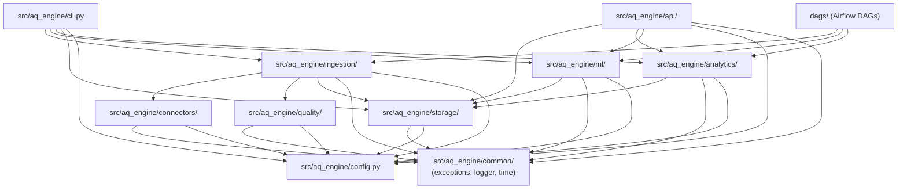

### How to read this diagram

Arrows represent direct Python `import` statements. Packages higher in the diagram depend on lower-level infrastructure and domain packages. `common` and `config` are foundational utility layers.

### Important observations

* **Acyclic Architecture:** The import graph is strictly directed and acyclic (DAG structure), with no circular imports between `analytics`, `ml`, and `ingestion`.


* **Independent Leaf Nodes:** `connectors` and `quality` do not depend on `storage` or `analytics`, allowing them to be unit tested in isolation without mocking databases.


* **Shared Foundations:** `common` (custom exceptions, structured logging, UTC timestamp utilities) and `config` are imported across all modules.


### Questions to ask yourself

1. Can you test `src/aq_engine/quality/validator.py` without spinning up a PostgreSQL instance?
2. If `src/aq_engine/storage/parquet_io.py` changes its schema, which upstream modules are directly affected?
3. Why don't connectors import the storage layer?
4. What prevents circular dependencies between the ML feature generation module and the analytical aggregation module?
5. How is runtime configuration propagated to deeply nested connectors?

---

## 5. Request Lifecycle (FastAPI Observations & Forecasts)

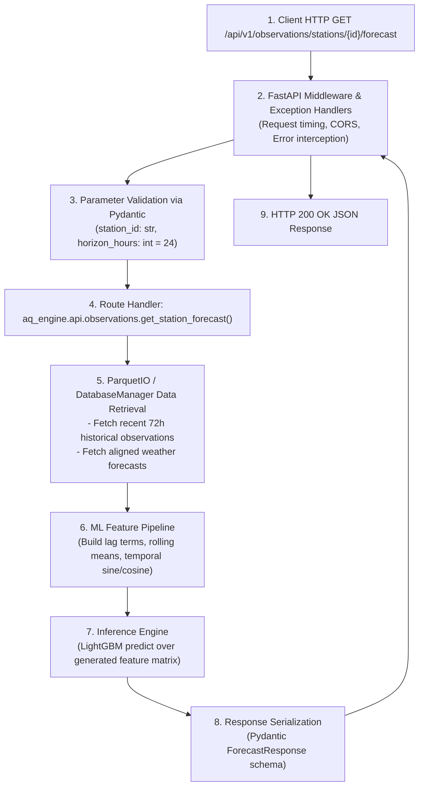

### How to read this diagram

This flow shows the end-to-end lifecycle of an HTTP forecast request from the moment it enters the ASGI web server until the JSON payload is returned to the client.

### Important observations

* **Real-time Feature Transformation:** Features for inference are assembled on the fly from stored historical lags and recent weather forecasts.


* **Type-Safe Ingress & Egress:** Pydantic models validate incoming query parameters and ensure serializable JSON schema adherence on exit.


* **In-Process Model Inference:** Model scoring runs directly inside the API process using the bundled LightGBM artifact.


### Questions to ask yourself

1. What error code is returned if `station_id` does not exist in the database?
2. How does the system handle predictions if recent weather data is missing from the Parquet store?
3. What performance bottleneck might arise during `StorageFetch` if historical Parquet partitions are fragmented?
4. How is the LightGBM model artifact loaded into memory (on startup vs. per-request)?
5. What HTTP response is returned if the ML inference pipeline fails unexpectedly?

---

## 6. Data Flow Diagram

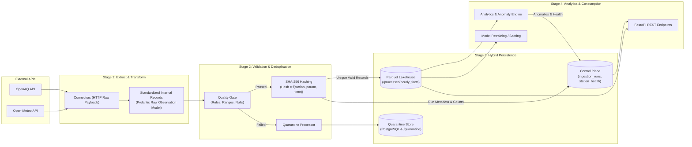

### How to read this diagram

This diagram traces raw data from external HTTP sources through validation, deduplication, persistent partitioned storage, and downstream analytics consumption.

### Important observations

* **Hard Quarantine Boundary:** Invalid records are branched off before reaching analytical Parquet partitions, ensuring clean downstream calculations.


* **Content Hashing:** Deduplication occurs in memory prior to disk write by evaluating the cryptographic hash of the record's natural key.


* **Separation of Fact and Anomaly Data:** Clean facts flow to Parquet; anomaly event flags and health metrics flow back to PostgreSQL.


### Questions to ask yourself

1. What fields comprise the composite natural key used for SHA-256 hashing?
2. If a quarantined record is later fixed, how is it re-ingested into the Parquet lakehouse?
3. How are late-arriving measurements processed if their partition month has already been written?
4. What happens when duplicate measurements with identical timestamps but differing pollutant values arrive?
5. How do dbt transformation models interact with the data written to the Parquet/Postgres layer?


---

## 7. Authentication & Authorization Flow

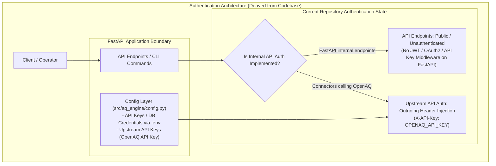

### How to read this diagram

This diagram reflects the **actual authentication mechanisms found in the repository** rather than an idealized standard pattern.

### Important observations

* **Explicit Fact — No Internal API Authentication:** *Observable from Code:* `src/aq_engine/api/main.py` and `observations.py` do not implement token verification, OAuth2, or session cookies. The REST API is designed for internal network or VPC deployment.


* **Outbound Connector Authentication:** `OpenAQConnector` reads `OPENAQ_API_KEY` from configuration and injects it into outgoing HTTP request headers.


* **Database Authentication:** Relational connections use PostgreSQL user/password credentials managed via environment variables (`POSTGRES_USER`, `POSTGRES_PASSWORD`).


### Questions to ask yourself

1. What changes would be required to add OAuth2 / JWT bearer token validation to `src/aq_engine/api/main.py`?


2. How should API keys be rotated without restarting the container services?
3. What security risk exists when running FastAPI unauthenticated on a publicly exposed port?
4. How do CLI commands authenticate against the PostgreSQL database?


5. Where are secrets and credentials stored in production versus local development?


---

## 8. Database Entity-Relationship (ER) Diagram

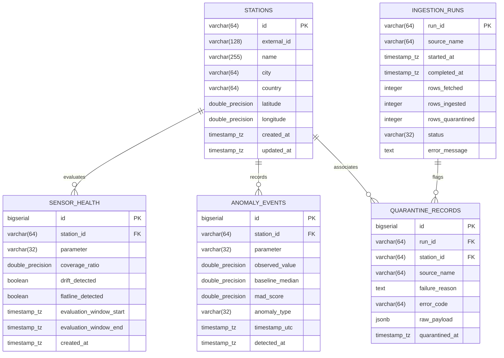

### How to read this diagram

This ER diagram shows the relational schema declared in `docker/postgres-init/01-init-control-plane.sql` and managed by `src/aq_engine/storage/db.py`, including keys, table columns, and foreign key relationships.

### Important observations

* **Control Plane Focus:** Tables store operational metrics, audits, and health scorecards rather than high-frequency raw sensor telemetry.


* **Foreign Key Integrity:** `station_id` anchors anomalies, sensor health logs, and quarantine entries back to the primary `stations` dimension.


* **JSONB Quarantine Flexibility:** `QUARANTINE_RECORDS` stores the malformed `raw_payload` as `JSONB`, ensuring arbitrary schema deviations can be inspected without causing ingestion crashes.


### Questions to ask yourself

1. What index should be placed on `ANOMALY_EVENTS` to optimize time-range queries per station?
2. Why is `QUARANTINE_RECORDS.raw_payload` stored as `jsonb` instead of discrete columns?
3. How does `INGESTION_RUNS` track partial failures versus total pipeline aborts?
4. What happens to `SENSOR_HEALTH` records if a station is deleted from the `STATIONS` table?
5. Why are hourly environmental facts not stored as a table in this relational schema?

---

## 9. Sequence Diagrams for 5 Core Operations

### Sequence 1: Hourly Ingestion & Validation Pipeline

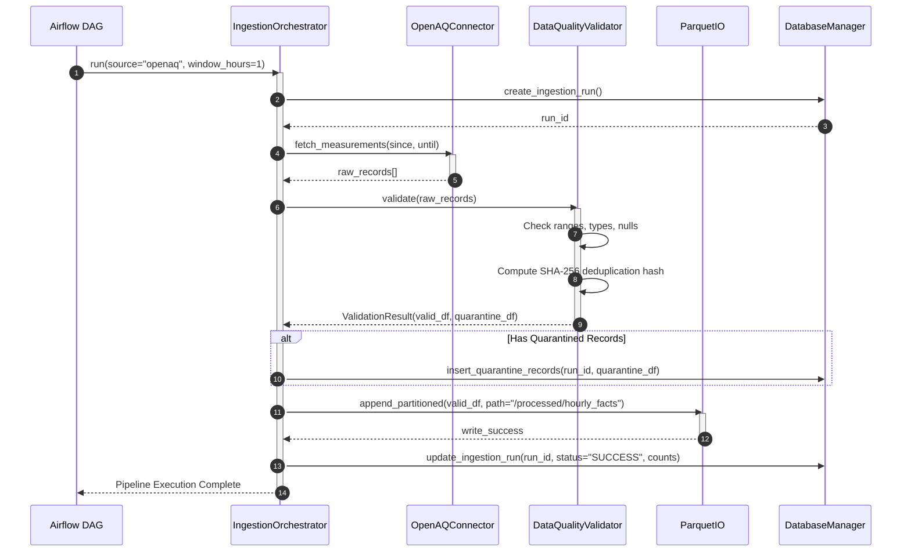

---

### Sequence 2: Statistical Anomaly Detection (MAD)

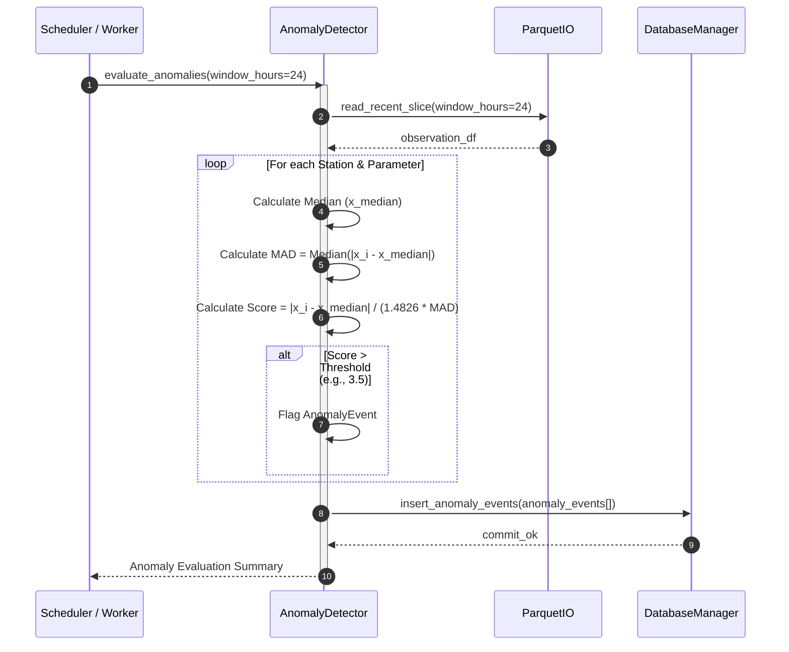

---

### Sequence 3: Sensor Health & Reliability Evaluation

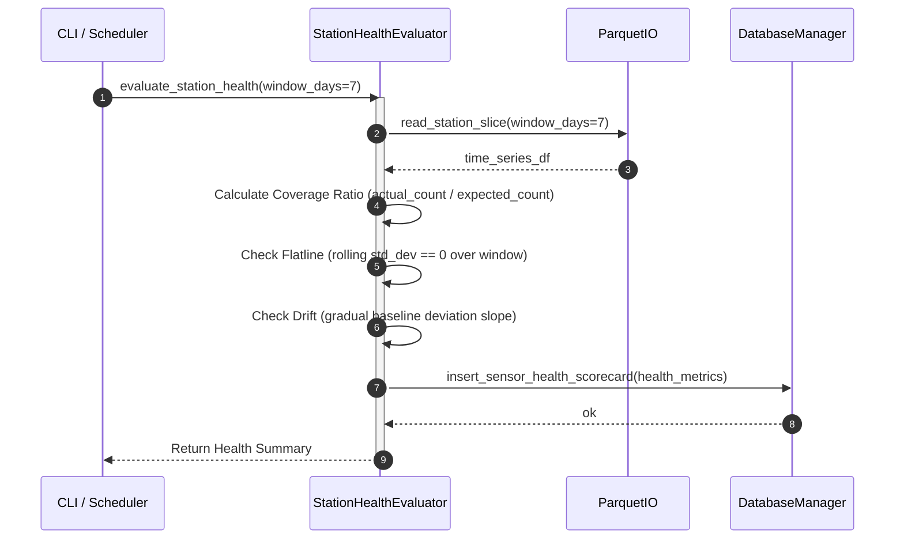

---

### Sequence 4: Machine Learning Model Training Lifecycle

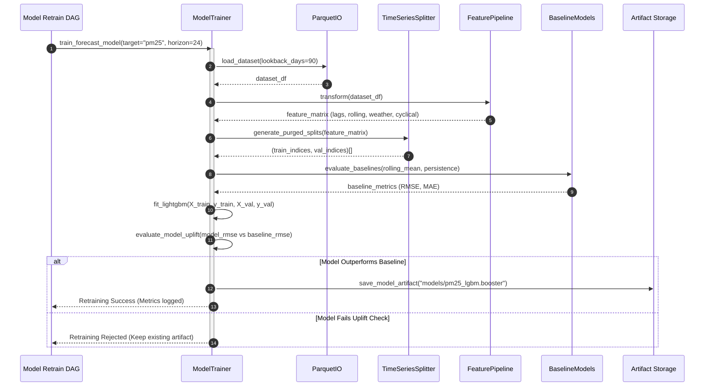

---

### Sequence 5: API Real-Time Forecast Query

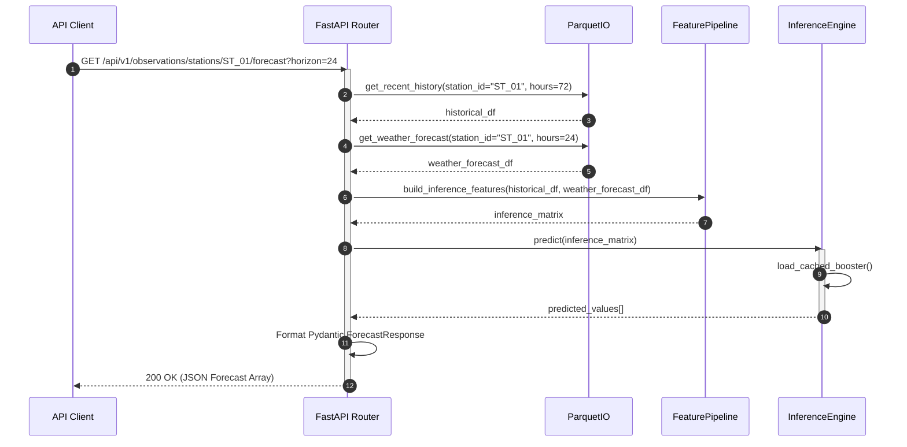

### How to read these sequence diagrams

These sequence diagrams follow the step-by-step method calls across objects, showing parameter passes, data transformations, branch conditions (e.g., `alt`), and asynchronous or synchronous completions.

### Important observations

* **Idempotent Ingestion Check (Sequence 1):** Ingestion runs are formally tracked with state identifiers in PostgreSQL before data commits to disk.


* **Baseline Uplift Gate (Sequence 4):** A trained machine learning model is only persisted if it objectively beats naive and persistence baseline models in evaluation.


* **Feature Pipeline Reuse (Sequence 4 & 5):** Feature engineering is centralized in a shared component used during both training and real-time inference.


### Questions to ask yourself

1. In Sequence 1, what happens if the worker process crashes after step 6 but before step 7?
2. In Sequence 2, how is the threshold multiplier ($k=3.5$) configured?
3. In Sequence 3, how does `StationHealthEvaluator` determine expected record count across missing hours?
4. In Sequence 4, what prevents future test fold records from leaking into training feature transformations?
5. In Sequence 5, what fallback response occurs if no model artifact has been trained yet?

---

## 10. Deployment Architecture & CI/CD Pipeline

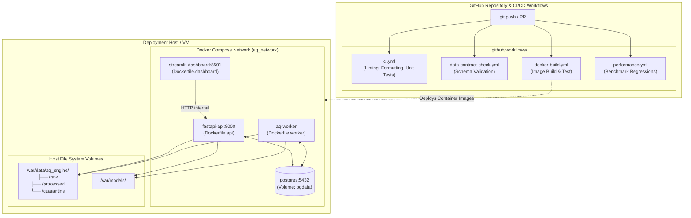

### How to read this diagram

This diagram illustrates the bridge between the GitHub Actions CI/CD automation and the Docker Compose runtime deployment model defined in `docker-compose.yml`.

### Important observations

* **Multi-Stage CI/CD Guardrails:** Every code change is verified by unit tests, schema contract adherence checks, multi-container Docker image builds, and performance benchmarks before merging.


* **Shared Storage Mounts:** The deployment relies on mapped bind volumes to ensure Parquet files and trained model artifacts persist across container rebuilds and restarts.


* **Isolated Container Network:** All services communicate within a private Docker bridge network (`aq_network`), with only designated ports (8000, 8501, 5432) exposed as needed.


### Unknowns & Non-Determined Elements

* **Cloud Orchestrator:** The repository provides Docker Compose and Dockerfiles; it does **not** include Kubernetes manifests, Helm charts, AWS ECS task definitions, or Terraform infrastructure-as-code files. Cloud infrastructure topology is explicitly marked as **unknown / not implemented in this repository**.


### Questions to ask yourself

1. How do the GitHub Actions workflows run integration tests that require PostgreSQL?
2. What volume permissions must be configured on the host machine to allow container workers to write to `/var/data/aq_engine/`?
3. How can the Docker Compose configuration be migrated to high-availability Kubernetes deployments?
4. How are database migrations executed when a new version of the application is deployed?
5. What monitoring mechanism watches the health of the Airflow scheduler container?